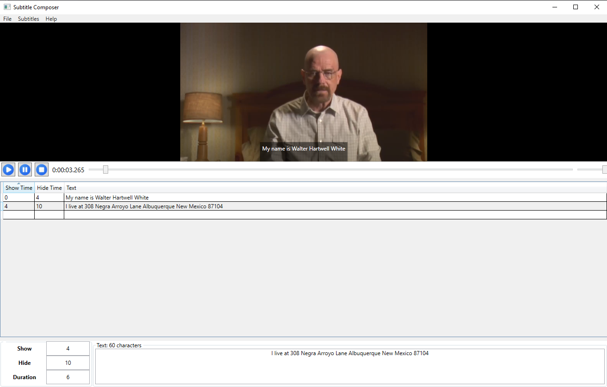
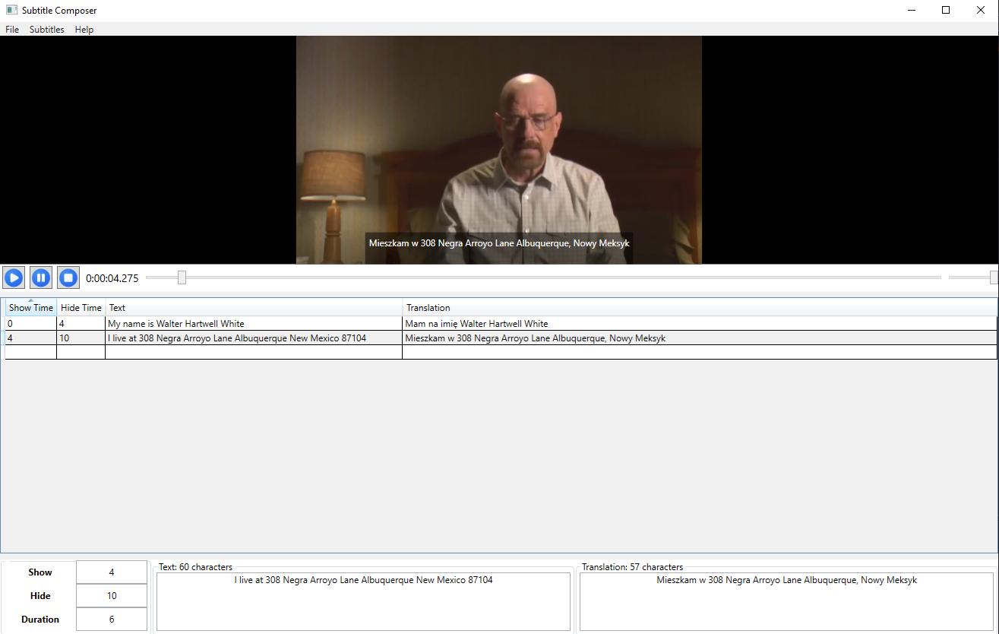

# Subtitle Composer
Subtitle Composer clone made in WPF as an assignment at 4th semester of Warsaw University of Technology.

## Features
#### App lets you edit subtitles for any video with live preview.

You can choose exact timeframe of every subtitle, edit text, import and export your subtitles in SubRip `.srt` format.

#### There is also an interface for creating translations.

## Additional info
Before using the app place the `SubRip.dll` into the `./plugins` folder at your `.exe` location to enable saving and loading subtitles feature.